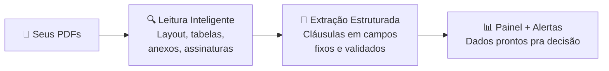

<CoverSlide
  eyebrow="Suporte Operacional: Fórum de Gestão Tecnológica"
  title="Do Dado à Decisão"
  subtitle="Soluções de IA Ajustadas ao <br>Negócio de Contratação"
  presenter="R. M. Ferrari"
  location="Vitória, ES"
  date="Junho de 2026"
/>

---

# Quem sou eu?

<CircularImage 
src="https://github.com/ramonferrari.png" 
size="180px"
borderColor="var(--rf-highlight)"
:scale="1.1"
x="120"
y="200"
/>


---


# Ciência de Dados

<div
  class="grid gap-0 mt-15 items-center"
  style="grid-template-columns: 1fr 1fr;"
>

<div>

<Venn
  top="Negócio"
  left="Estatística"
  right="Computação"
  center="Ciência de\nDados"
  size="430px"
  :transpLight="0.20"
  :transpDark="0.15"
/>

</div>

<div v-click>

<Venn
  top="Contratos"
  left="Análise e projeção \n de dados"
  right="Algoritmos e IA"
  center="\n🫵"
  centerSize="70"
  size="430px"
  :transpLight="0.20"
  :transpDark="0.15"
/>

</div>

</div>

---

# Somos todos cientistas

<DataVSContract />

---


# Gestão de Contratos

- Documento → risco silencioso
- 80 páginas → ninguém lê tudo
- O problema já está lá. Esperando.

<Spacer :h="28"/>

<BeforeAfter language="pt">>
<template #before>

Você vai ao contrato quando o problema <HighLight  color="#EC635E"> já aconteceu</HighLight>.

</template>
<template #after>

Com IA: o contrato <HighLight color="#e2f81b"> te avisa antes</HighLight>.

</template>
</BeforeAfter>

::note::
Contratos: não são apenas documentos. São riscos silenciosos espalhados em 80 páginas que você não tem tempo de ler.

Gestão contratual tradicional considera cada contrato um documento, e até um potencial fator de risco. A gente fala em "contrato" no corredor e as pessoas associam com problemas.

A IA transforma contratos em sinais operacionais, informações vivas capazes de te avisarem antes que o problema aconteça.

---

# Luz sobre riscos silenciosos

<AISpotlight />

---

# O que a IA sabe

<AIKnowledge />

---

# A IA não tem memória. Tem mesa de trabalho.

<Contextdesk />

---

# Corrida das IAs

<AICompetition />

---

# Tanto faz o modelo? Atenção aos flash X pro

<ModelComparison />

---

# Os Dois Conflitos da IA

<div class="flex items-center gap-4 mt-4" style="font-size: 0.8rem; line-height: 1.4;">

<div class="glass p-3 flex-1" style="border-color: rgba(99,211,161,0.45); text-align: center;">

<span style="color: #63d3a1; font-weight: 700;">🧠 Fiel ao treinamento</span>  
Ser completa. Agradar. Parecer confiante. Nunca deixar uma pergunta sem resposta.

</div>

<div style="font-size: 1rem; font-weight: 700; flex-shrink: 0; text-align: center; opacity: 0.45; letter-spacing: 0.1em;">vs</div>

<div class="glass p-3 flex-1" style="border-color: rgba(226,248,27,0.45); text-align: center;">

<span style="color: #e2f81b; font-weight: 700;">📋 Seguir suas instruções</span>  
Ser precisa. Dizer N/E. Citar a fonte. Usar só o que está no documento.

</div>

</div>

<div class="grid grid-cols-3 gap-2 mt-3" style="font-size: 0.7rem; line-height: 1.35;">

<div v-click class="glass p-3" style="border-top: 2px solid #EC635E;">

<span style="color: #EC635E; font-weight: 700;">"Se não encontrar, põe N/E"</span>

Treinamento: resposta vazia não agrada.

→ IA inventa **8%** com total confiança.

</div>

<div v-click class="glass p-3" style="border-top: 2px solid #EC635E;">

<span style="color: #EC635E; font-weight: 700;">"Extraia só o valor total"</span>

Treinamento: ser completo é ser útil.

→ IA adiciona interpretações e avisos que ninguém pediu.

</div>

<div v-click class="glass p-3" style="border-top: 2px solid #EC635E;">

<span style="color: #EC635E; font-weight: 700;">"Use só o documento enviado"</span>

Treinamento: multas ficam entre 5–10%.

→ IA "preenche" cláusula vaga com conhecimento geral.

</div>

</div>

::note::
Antes de falar nos limites técnicos, é importante entender o conflito de objetivos. A IA não falha por acidente — ela falha porque foi treinada para um objetivo (agradar, ser completa) que às vezes entra em rota de colisão com o que você precisa (precisão, rastreabilidade, contenção).

---

# Os Dois Limites da IA

<div class="relative" style="height: 355px; margin-top: 0.5rem;">

<svg viewBox="0 0 900 355" xmlns="http://www.w3.org/2000/svg" style="position: absolute; inset: 0; width: 100%; height: 100%;">
  <defs>
    <radialGradient id="innerGrad" cx="50%" cy="50%" r="50%">
      <stop offset="0%" stop-color="#63d3a1" stop-opacity="0.18"/>
      <stop offset="100%" stop-color="#63d3a1" stop-opacity="0.03"/>
    </radialGradient>
    <radialGradient id="inventouGrad" cx="50%" cy="50%" r="50%">
      <stop offset="0%" stop-color="#e2f81b" stop-opacity="0.15"/>
      <stop offset="100%" stop-color="#e2f81b" stop-opacity="0.02"/>
    </radialGradient>
    <filter id="softGlow" x="-20%" y="-20%" width="140%" height="140%">
      <feGaussianBlur stdDeviation="3" result="blur"/>
      <feMerge><feMergeNode in="blur"/><feMergeNode in="SourceGraphic"/></feMerge>
    </filter>
    <style>
      .svg-label { font-size: 13px; font-weight: 400; letter-spacing: 0.03em; font-family: 'Space Grotesk', sans-serif; }
      .svg-label-bold { font-size: 13px; font-weight: 600; letter-spacing: 0; font-family: 'Space Grotesk', sans-serif; }
      .svg-badge { font-size: 11px; font-weight: 600; letter-spacing: 0; font-family: 'Space Grotesk', sans-serif; }
    </style>
  </defs>

  <!-- CLIQUE 0: sempre visível — contrato -->
  <circle cx="450" cy="183" r="145"
    fill="rgba(99,211,161,0.03)"
    stroke="#63d3a1"
    stroke-width="1.5"
    stroke-dasharray="9 6"
    opacity="0.7"/>
  <text x="450" y="27" text-anchor="middle"
    class="svg-label"
    style="font-size:13px; font-weight:400; letter-spacing:0.03em; font-family:'Space Grotesk',sans-serif;"
    fill="rgba(99,211,161,0.65)">O que estava no contrato</text>

  <!-- CLIQUE 1: o que a IA achou -->
  <g v-click>
    <circle cx="468" cy="177" r="110"
      fill="url(#innerGrad)"
      stroke="#63d3a1"
      stroke-width="1.5"
      filter="url(#softGlow)"/>
    <circle cx="412" cy="138" r="3" fill="#63d3a1" opacity="0.75"/>
    <line x1="420" y1="138" x2="542" y2="138" stroke="#63d3a1" stroke-width="1.8" stroke-linecap="round" opacity="0.55"/>
    <circle cx="412" cy="157" r="3" fill="#63d3a1" opacity="0.75"/>
    <line x1="420" y1="157" x2="524" y2="157" stroke="#63d3a1" stroke-width="1.8" stroke-linecap="round" opacity="0.5"/>
    <circle cx="412" cy="176" r="3" fill="#63d3a1" opacity="0.75"/>
    <line x1="420" y1="176" x2="538" y2="176" stroke="#63d3a1" stroke-width="1.8" stroke-linecap="round" opacity="0.55"/>
    <circle cx="412" cy="195" r="3" fill="#63d3a1" opacity="0.75"/>
    <line x1="420" y1="195" x2="514" y2="195" stroke="#63d3a1" stroke-width="1.8" stroke-linecap="round" opacity="0.5"/>
    <circle cx="412" cy="214" r="3" fill="#63d3a1" opacity="0.75"/>
    <line x1="420" y1="214" x2="528" y2="214" stroke="#63d3a1" stroke-width="1.8" stroke-linecap="round" opacity="0.55"/>
    <text x="468" y="308" text-anchor="middle"
      class="svg-label-bold"
      style="font-size:13px; font-weight:600; letter-spacing:0; font-family:'Space Grotesk',sans-serif;"
      fill="rgba(99,211,161,0.85)">O que a IA achou</text>
  </g>

  <!-- CLIQUE 2: perdeu (vermelho) -->
  <g v-click>
    <circle cx="323" cy="153" r="3.5" fill="#EC635E" opacity="0.55"/>
    <circle cx="312" cy="183" r="3"   fill="#EC635E" opacity="0.45"/>
    <circle cx="319" cy="213" r="3.5" fill="#EC635E" opacity="0.55"/>
    <circle cx="336" cy="137" r="2.5" fill="#EC635E" opacity="0.35"/>
    <circle cx="341" cy="167" r="3"   fill="#EC635E" opacity="0.45"/>
    <circle cx="331" cy="198" r="2.5" fill="#EC635E" opacity="0.4"/>
    <circle cx="349" cy="145" r="2.5" fill="#EC635E" opacity="0.3"/>
    <circle cx="346" cy="222" r="2.5" fill="#EC635E" opacity="0.35"/>
    <circle cx="321" cy="173" r="2"   fill="#EC635E" opacity="0.3"/>
    <rect x="240" y="108" width="72" height="22" rx="5"
      fill="rgba(236,99,94,0.12)" stroke="#EC635E" stroke-width="1" opacity="0.9"/>
    <text x="276" y="123" text-anchor="middle"
      class="svg-badge"
      style="font-size:11px; font-weight:600; font-family:'Space Grotesk',sans-serif;"
      fill="#EC635E">perdeu</text>
  </g>

  <!-- CLIQUE 3: inventou (verde-limão) -->
  <g v-click>
    <circle cx="636" cy="250" r="58"
      fill="url(#inventouGrad)"
      stroke="#e2f81b"
      stroke-width="1.5"
      stroke-dasharray="7 5"
      opacity="0.85"/>
    <line x1="582" y1="237" x2="688" y2="237" stroke="#e2f81b" stroke-width="1.5" stroke-linecap="round" opacity="0.5"/>
    <line x1="580" y1="251" x2="690" y2="251" stroke="#e2f81b" stroke-width="1.5" stroke-linecap="round" opacity="0.5"/>
    <line x1="584" y1="265" x2="684" y2="265" stroke="#e2f81b" stroke-width="1.5" stroke-linecap="round" opacity="0.5"/>
    <rect x="598" y="310" width="80" height="22" rx="5"
      fill="rgba(226,248,27,0.10)" stroke="#e2f81b" stroke-width="1" opacity="0.9"/>
    <text x="638" y="325" text-anchor="middle"
      class="svg-badge"
      style="font-size:11px; font-weight:600; font-family:'Space Grotesk',sans-serif;"
      fill="#e2f81b">inventou</text>
  </g>

</svg>

<!-- Left card: aparece no clique 2 (junto com os pontos vermelhos) -->
<div v-click="2" class="glass p-4" style="position: absolute; left: 0; top: 55px; width: 190px; border-color: rgba(236,99,94,0.45);">
  <div style="color: #EC635E; font-weight: 700; font-size: 0.82rem; margin-bottom: 0.4rem; line-height: 1.3;">⚠ A IA pode perder informação</div>
  <p style="font-size: 0.75rem; line-height: 1.5; opacity: 0.7; margin: 0;">Algo estava no contrato, mas não apareceu na resposta.</p>
</div>

<!-- Right card: aparece no clique 3 (junto com o círculo amarelo) -->
<div v-click="3" class="glass p-4" style="position: absolute; right: 0; top: 55px; width: 190px; border-color: rgba(226,248,27,0.45);">
  <div style="color: #e2f81b; font-weight: 700; font-size: 0.82rem; margin-bottom: 0.4rem; line-height: 1.3;">⚠ A IA pode inventar informação</div>
  <p style="font-size: 0.75rem; line-height: 1.5; opacity: 0.7; margin: 0;">Algo apareceu na resposta, mas não estava no contrato.</p>
</div>

</div>

::note::
Dois problemas opostos — ao mesmo tempo. Recall: ela não cobre tudo e não avisa o que perdeu. Alucinação: ela vai além do que estava no documento sem avisar. Os próximos dois slides detalham cada um.

---

# Limite 1: Recall

<div class="grid grid-cols-2 gap-8 mt-12">

<div class="glass p-6">

### O que estava no contrato

<div class="mt-4" style="line-height: 2.2">

✓ Renovação automática  
✓ Prazo de aviso: 90 dias  
✓ Multa — Anexo D  
✓ Foro de eleição  
✓ Cláusula de exclusividade  

</div>

</div>

<div class="glass p-6">

### O que a IA devolveu

<div class="mt-4" style="line-height: 2.2">

<span style="color: var(--rf-primary)">✓ Renovação automática</span>  
<span style="color: var(--rf-primary)">✓ Prazo de aviso: 90 dias</span>  
<span style="color: #EC635E">✗ Multa — Anexo D</span>  
<span style="color: #EC635E">✗ Foro de eleição</span>  
<span style="color: #EC635E">✗ Cláusula de exclusividade</span>  

</div>

<div class="mt-6 opacity-70 text-sm">

Sem avisar que perdeu.

</div>

</div>

</div>

::note::
O estagiário pelo menos diria 'esse aqui eu não entendi bem.' A IA devolve a lista com a mesma confiança — tenha encontrado tudo ou não.

---

# Limite 2: Alucinação

<div class="mt-10">

A IA tem pavor de dizer **"não sei"**.

Quando não encontra — **ela inventa**.

Com a mesma voz de quem encontrou.

</div>

::note::
O segundo limite se chama alucinação. É quando a IA não encontra a informação — mas em vez de dizer 'não sei', ela cria uma resposta que parece plausível. Testei isso: peguei um contrato que não tinha multa rescisória definida. Perguntei: 'qual é o valor da multa?' Ela respondeu: 8%. Com total confiança. De onde veio esse 8%? Ela também não sabe.

---

# O GPS no Lago

<div class="grid gap-8 mt-6" style="grid-template-columns: 1fr 1fr;">

<div>

### IA sem validação

A IA não avisa quando erra. Em contratos, um número inventado numa cláusula pode custar muito caro.

<div class="glass p-4 mt-8" style="border-color: #EC635E;">

**Confiante. Errado. Sem avisar.**

</div>

</div>

<LLMChat prompt="Qual é a multa rescisória deste contrato?" model="GPT-4" provider="OpenAI" version="2024-01">

A multa rescisória é de **8% do valor total**, conforme estabelecido na Cláusula 12.3.

</LLMChat>

</div>

::note::
O contrato não tinha multa definida. A Cláusula 12.3 não existe. A IA criou as duas coisas com total confiança.

---

# A IA Quer te Agradar

<div class="mt-10">

A IA foi **literalmente treinada pra te agradar**.

Aprende com feedback humano — quando a gente gosta da resposta, ela reforça aquilo.

O problema: **"te agradar" e "ser preciso"** são objetivos opostos.

</div>

::note::
Sabe por que a IA alucina com tanta frequência? Porque ela foi treinada pra te agradar. Quando você pergunta 'qual é a multa rescisória?' — a resposta que te agrada é um número. A resposta honesta, se o contrato não define, é: 'não existe.' Mas adivinhem qual ela prefere te dar.

---

# Limite 3: Variabilidade de Documentos

<div class="grid grid-cols-3 gap-4 mt-8" style="font-size: 0.85rem;">

<div class="glass p-4">

### Contrato A — 2015

```
Multa rescisória:
5% do valor total
```

✓ Simples. IA acha fácil.

</div>

<div class="glass p-4">

### Contrato B — 2019

```
Penalidade conforme
tabela do Anexo D
```

⚠️ Anexo D não está
no PDF.

</div>

<div class="glass p-4">

### Contrato C — 2023

```
Indenização pelos
custos operacionais
até a data...
```

✗ Quanto é isso?
Depende de variáveis
externas.

</div>

</div>

::note::
Terceiro limite — esse não é culpa da IA. É culpa dos próprios contratos. Três formas diferentes de dizer — ou não dizer — a mesma coisa. Multiplicado por 80 contratos, isso vira um problema operacional.

---

# O Chaveiro ✂️

<div class="grid grid-cols-3 gap-5 mt-8" style="font-size: 0.85rem;">

<div class="glass p-5" style="border-color: var(--rf-primary);">

🔑 **Prompt genérico**

→ Contrato 2015  
**Funciona.**  
"Multa: 5% do valor total"

</div>

<div class="glass p-5" style="border-color: #e2f81b; opacity: 0.75;">

🗝️ **Mesmo prompt**

→ Contrato 2019  
**Falha.**  
"Penalidade conforme Anexo D"

</div>

<div class="glass p-5" style="border-color: #EC635E; opacity: 0.6;">

🔐 **Mesmo prompt**

→ Contrato 2023  
**Inventa.**  
"8% do valor total" ← alucinação

</div>

</div>

<div class="glass mt-6 p-4 text-center" style="font-size: 0.95rem;">

A solução não é ter mais força — é ter a chave certa para cada fechadura.

</div>

---


# Classificação

<Classification />

---

# Projeção

<Regression />

---

# Agrupamentos

<Clustering />

---

# Redes

<GraphNetwork />

---

# Acompanhamento temporal

<TimeSeries />

---

# O Elo que Faltava

<div class="glass mt-16 p-10 text-center">

### Todas essas técnicas precisam da mesma coisa:

**dados estruturados.**

Não PDFs. Dados.

</div>

<v-click>

<div class="glass mt-6 p-6 text-center">

O elo que faltava é transformar **PDF em dado**.

</div>

</v-click>

---

# Extração de Dados

<ContractExtraction />

---

# Caso 01
## Extração na Prática

<div class="grid gap-12 mt-5"
style="grid-template-columns: 4fr 6fr;"
>

<div>

<div style="font-size: 0.9rem">
<PromptCard title="Extração Dados">
Você é um assessor jurídico especista em digitalização de informações do contrato recebido Extraia:

  - Categoria, entre: engenharia, jurídico, saúde ou secretaria.
  - Número de posições
  - Valor mensal
  - Fornecedor
</PromptCard>
</div>
</div>

<v-click>

<div style="font-size: 0.9rem">
<div>
  <table class="rf-table">
    <thead>
      <tr>
        <th>Categoria</th>
        <th>Posições</th>
        <th>Valor mensal</th>
        <th>Fornecedor</th>
      </tr>
    </thead>
    <tbody>
      <tr>
        <td>Engenharia</td>
        <td>82</td>
        <td>R$ 1.600.000</td>
        <td>BB Consulting</td>
      </tr>
      <tr>
        <td>Jurídico</td>
        <td>12</td>
        <td>R$ 480.000</td>
        <td>Lex Group</td>
      </tr>
      <tr>
        <td>Secretariado</td>
        <td>24</td>
        <td>R$ 210.000</td>
        <td>Prime Office</td>
      </tr>
      <tr>
        <td>Saúde</td>
        <td>18</td>
        <td>R$ 234.000</td>
        <td>MedCayre</td>
      </tr>
    </tbody>
  </table>
</div>
</div>
</v-click>


</div>

---

# Então o Que Fazer?

<div class="text-center mt-16">

Voltamos pro **papel** e pro **advogado**?

</div>

<v-click>

<div class="text-center mt-8">

**Não.** Mas a IA crua também não é suficiente.

O que funciona é **colocar estrutura em volta da IA**.

</div>

</v-click>

::note::
O que você faz? Volta pro papel e pro advogado lendo contrato por contrato? Não. Mas a IA crua também não é suficiente — pelo menos não pra quem precisa de confiabilidade, rastreabilidade e escala.

---

# 🔦 FAROL DE CONTRATOS

<div class="glass mt-12">

**Inteligência aplicada à gestão de contratos.**

Você carrega seus PDFs — do jeito que estão — e o sistema lê, extrai as informações críticas, organiza num painel e avisa quando algo precisa de atenção.

Não substitui o advogado. Substitui o trabalho de ler 50 páginas pra descobrir uma data.

</div>

::note::
O Farol de Contratos é uma solução que resolve exatamente o que mostrei. Primeira aparição do nome e conceito.

---

# Como Funciona

<ArchitectureFlow>



</ArchitectureFlow>

::note::
Primeiro: o sistema lê o PDF de verdade. Segundo: extrai informações em campos fixos, não inventa. Terceiro: tudo aparece num painel com alertas e scores de risco.

---

# A Lista de Mercado

<Spacer :h="20"/>

<BeforeAfter language="pt">
<template #before>

**IA crua:** "Analise este contrato."

→ Volta com o que achou  
→ Formato diferente toda vez  
→ Você não sabe o que faltou  

</template>
<template #after>

**Com estrutura:** "Extraia: multa, vencimento, renovação. Se não encontrar: N/E."

→ Você sabe o que pediu  
→ Mesmo formato, sempre  
→ Você sabe o que faltou  

</template>
</BeforeAfter>

---

# O Detetive

<div class="grid gap-8 mt-6" style="grid-template-columns: 1fr 1fr;">

<div>

### Você não precisa confiar — você pode verificar

IA crua diz "5%". Você torce pra estar certo.

O Farol diz "5%" — e te mostra de onde veio.

<div class="glass p-4 mt-6" style="font-size: 0.9rem; border-color: var(--rf-primary);">

Você pode abrir o PDF e conferir.  
Sempre.

</div>

</div>

<TerminalBlock>

> Extração: contrato_fornecedor_A.pdf

Multa rescisória: 5%
  → Cláusula 8.2, página 12

Renovação automática: Sim
  → Cláusula 14.1, página 18

Foro de eleição: N/E
  → Campo não encontrado

</TerminalBlock>

</div>

::note::
O que mais me incomoda na IA crua é que você não sabe de onde veio a resposta. O Farol funciona diferente: quando extrai, ele cita a fonte. Você pode abrir o PDF e conferir.

---

# DEMONSTRAÇÃO

<div class="text-center mt-20">

Carregando contratos reais...

</div>

::note::
Neste momento você compartilha a tela do sistema. 
- Passso 1: Carregamento de 5 contratos reais
- Passo 2: Processamento (30-60s) — o sistema está lendo layout, identificando cláusulas, estruturando em campos
- Passo 3: Painel aparece — cinco contratos, dois em Risco Alto, um em Crítico
- Passo 4: Clica no contrato crítico — renovação automática detectada, prazo 90 dias, data limite calculada
- Passo 5: Mostra a fonte — Cláusula 8.2, página 12, rastreável
- Passo 6: Campo com baixa confiança em amarelo — sistema marcou incerteza em vez de inventar

---

# O Que o Farol Extrai (Padrão)

<div class="mt-10">

<div class="glass p-6">

```
✓  Número do contrato
✓  Quem contrata / quem é contratado
✓  Valor total
✓  Data de assinatura
✓  Data de vencimento
✓  Score de risco (Baixo / Médio / Alto / Crítico)
✓  Tem renovação automática? (Sim / Não)
```

</div>

</div>

<div class="mt-6 text-sm opacity-75">

**Mas cada negócio tem o que importa pra ele.**

</div>

::note::
Esses são os campos que o Farol extrai por padrão. É um bom começo pra qualquer empresa. Mas é só o começo.

---

# O Cardápio

<div class="grid grid-cols-3 gap-4 mt-8" style="font-size: 0.85rem;">

<div class="glass p-5">

**🚛 Logística**

SLA de entrega garantido  
Multa por atraso  
Responsabilidade por avaria  

</div>

<div class="glass p-5">

**🏛️ Setor público**

Número da licitação  
Dotação orçamentária  
Vigência fiscal  

</div>

<div class="glass p-5">

**🔄 Serviços recorrentes**

Cláusula de exclusividade  
Reajuste (IPCA / IGP-M)  
Prazo de rescisão sem multa  

</div>

</div>

<div class="glass mt-6 p-4 text-center">

**Qualquer campo que faz sentido — o Farol extrai.**

</div>

---

# O Que Está Faltando?

<div class="glass mt-16 text-center p-12">

### O que vocês sentiriam falta no dia a dia?

**Olhando pra lista de campos padrão — qual informação vocês queria ter tido?**

</div>

::note::
Esse é o slide mais importante da segunda metade. Deixa alguém responder. Anota o que as pessoas falam — vai virar argumento personalizado na conversa depois.

---

# O Que o Farol NÃO Faz

<div class="grid grid-cols-2 gap-8 mt-10">

<div class="glass p-6">

### O Farol FAZ

✓ Extrai dados estruturados  
✓ Identifica padrões  
✓ Alerta sobre anomalias  
✓ Escala para centenas  
✓ Rastreia a fonte  
✓ Marca incertezas  

</div>

<div class="glass p-6">

### O Farol NÃO FAZ

✗ Julga se o contrato é bom ou ruim  
✗ Interpreta lei  
✗ Resolve anexos faltantes  
✗ Substitui advogado em casos complexos  

</div>

</div>

::note::
A divisão de trabalho é clara: Farol faz o trabalho sujo de leitura. Você e seu time fazem o trabalho que exige julgamento.

---

# Moral

<div class="glass mt-16 p-10 text-center">

### Informação escondida num PDF não serve pra ninguém.

**O Farol ilumina o que está lá —**

**pra você decidir com dados, não com sorte.**

</div>

---

# Perguntas?

<div class="text-center mt-20">

🔦 **FAROL DE CONTRATOS**

ramon.ferrari@gmail.com

</div>

