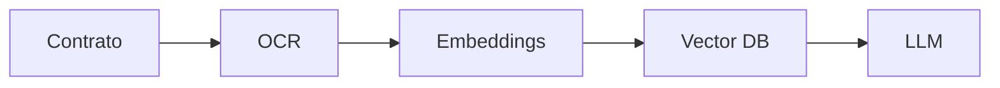
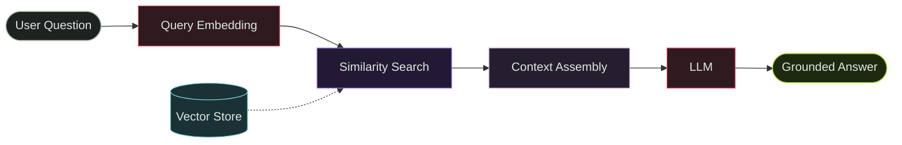
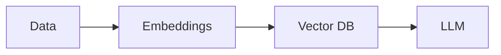

# AI Governance
<div class="glass mt-8">
  Large language models are reshaping
  organizational decision-making,
  knowledge systems,
  and strategic cognition.
      <div class="mt-6 flex gap-3">
      <span class="tag">LLMs</span>
      <span class="tag">Strategy</span>
      <span class="tag">Governance</span>
      </div>
  </div>

---
layout: hero
---
# Strategic AI

Future computational paradigms
and organizational uncertainty.

# From Theme Setup to Strategic Storytelling

<div class="glass mt-8">

You are no longer configuring
a presentation framework.
You are building a visual system.

<div class="mt-6 flex gap-3">
<span class="tag">Slidev</span>
<span class="tag">Systems</span>
<span class="tag">Design Language</span>
</div>

</div>

---

# Your deck already inherits your visual identity

<div class="grid grid-cols-2 gap-6 mt-10">

<div class="glass p-6">

## Already inherited
<ul>
  <li>Background system</li>
  <li>Green glow accents</li>
  <li>Typography</li>
  <li>Glassmorphism</li>
  <li>Cards</li>
  <li>Tags</li>
  <li>Dark / Light mode</li>
</ul>

</div>

<div class="glass p-6">

## Result
The presentation already feels like:
<ul>
  <li>your site</li>
  <li>your research</li>
  <li>your technical aesthetic</li>
  <li>your systems-thinking identity</li>
</ul>

</div>

</div>

---

# Minimal authoring now works

<div class="glass mt-8">

```md
# AI Governance
Large language models
are reshaping
organizational cognition.
```

</div>

<div class="mt-10">

And the slide already gets:

* typography
* spacing
* palette

</div>

---

# Teste antes-depois

<BeforeAfter>

<template #before>

- leitura manual
- busca textual
- revisão demorada

</template>

<template #after>

- RAG
- busca semântica
- análise contextual

</template>

</BeforeAfter>

---
# Teste cartao risco

<RiskCard
  level="high"
  title="Hallucination Risk"
>

LLMs podem gerar interpretações
incorretas sem grounding.

</RiskCard>


---
# Teste métrica 2 (pulando espaço)

<Spacer :h="98"/>

<div class="rf-metrics-2">

<MetricCard
  value="78%"
  label="redução do tempo"
/>

<MetricCard
  value="4h → 18min"
  label="triagem contratual"
/>

</div>

---

# Teste métrica 3 (regular)


<div class="rf-metrics-3">

<MetricCard
  value="78%"
  label="redução do tempo"
/>

<MetricCard
  value="4h → 18min"
  label="triagem"
/>

<MetricCard
  value="92%"
  label="consenso dos especialistas"
/>

</div>


---

# Teste métrica 3 (destaque)

<div class="rf-metrics-2">

<MetricCard
  value="78%"
  label="redução do tempo"
/>

<MetricCard
  value="4h → 18min"
  label="triagem"
/>

</div>

<div class="mt-6">

<MetricCard
  value="92%"
  label="consenso dos especialistas"
/>

</div>


---

# Teste métrica 4
<div class="rf-metrics-4">

<MetricCard
  value="78%"
  label="tempo"
/>

<MetricCard
  value="18"
  label="especialistas"
/>

<MetricCard
  value="3"
  label="rodadas"
/>

<MetricCard
  value="92%"
  label="consenso"
/>

</div>

---
# Teste arquitetura
<ArchitectureFlow>


</ArchitectureFlow>


---


# Mermaid Test


---

# The real shift

<div class="grid grid-cols-2 gap-8 mt-10">

<div class="glass p-8">

### Before
Configuring:
<ul>
  <li>themes</li>
  <li>CSS</li>
  <li>layouts</li>
  <li>exports</li>
  <li>compatibility</li>
</ul>

</div>

<div class="glass p-8">

### Now
Creating:
<ul>
  <li>ideas</li>
  <li>narratives</li>
  <li>architectures</li>
  <li>visual reasoning</li>
  <li>strategic communication</li>
</ul>

</div>

</div>

---

# Um novo aqui
Testando

<GlassCard
  subtitle="Technical"
  title="Technical content"
>

- Mermaid
- Architecture flows
- AI systems

</GlassCard>

---

# Testando 2
## what
### is happening

<Spacer :h="" />

<div class="grid grid-cols-3 gap-6">

<GlassCard
  subtitle="Communication"
  title="Executive presentations"
>

- Workshops
- Talks
- Strategy

</GlassCard>

<GlassCard
  subtitle="AI"
  title="Technical systems"
>

- RAG
- LLMs
- Agents

</GlassCard>

<GlassCard
  subtitle="Research"
  title="Decision systems"
>

- Delphi
- Governance
- Uncertainty

</GlassCard>

</div>


---

# The next maturity level

### Reusable components

<div class="grid grid-cols-2 gap-6 mt-10">

<div class="glass p-6">

#### components/

</div>

<div class="glass p-6">

<ul>
  <li>Tag.vue</li>
  <li>MetricCard.vue</li>
  <li>ResearchQuote.vue</li>
  <li>ArchitectureBlock.vue</li>
  <li>Timeline.vue</li>
  <li>PaperCard.vue</li>
</ul>

</div>

</div>

---

# Why components matter

<div class="glass mt-8">

Instead of writing HTML repeatedly:

<div class="glass mb-4">
...
</div>

You start writing concepts:

<MetricCard
  title="18 Experts"
  value="3 Delphi Rounds"
/>

</div>

---

# Your stack already supports

<div class="grid grid-cols-3 gap-5 mt-10">

<div class="glass p-5">

### Communication
<ul>
  <li>Talks</li>
  <li>Workshops</li>
  <li>Executive presentations</li>
</ul>

</div>

<div class="glass p-5">

### Technical content
<ul>
  <li>Mermaid</li>
  <li>Architecture flows</li>
  <li>AI systems</li>
  <li>Research visuals</li>
</ul>

</div>

<div class="glass p-5">

### Distribution
<ul>
  <li>HTML hosting</li>
  <li>PDF export</li>
  <li>Dark/light</li>
  <li>Responsive slides</li>
</ul>

</div>

</div>

---

# Before building complexity

### write real slides

<div class="glass mt-10">

The first 10 real slides reveal:
<ul>
  <li>what layouts you actually use</li>
  <li>what components repeat</li>
  <li>where friction exists</li>
  <li>which abstractions are useful</li>
</ul>

</div>

---

# Test Mermaid



---

# Test code rendering

```python
print("hello")
```

---

<BrowserWindow title="ChatGPT">

# AI Governance

LLMs are reshaping

organizational cognition.

</BrowserWindow>

---

<TerminalBlock>

> user:
Explain RAG architecture.

> assistant:
Retrieval-Augmented Generation combines:

- vector search
- embeddings
- LLM reasoning

to inject external context
into generation workflows.

</TerminalBlock>

---

# Test quote slides

<div class="glass mt-12">

> AI is becoming organizational infrastructure.

</div>

---

# Test llm
<LLMChat prompt="Explain AI governance." model="GPT-5.5" provider="OpenAI" version="2026-05">

AI governance refers to the structures,

principles,

and organizational mechanisms

used to supervise AI systems.

</LLMChat>

---

# Test glass cards

<div class="glass mt-12 p-10">

This is a reusable visual container.

It already inherits:
* blur
* glow
* border system
* spacing
* typography

</div>

---

# The moment everything clicks

<div class="glass mt-16 text-center p-12">

“This feels like a product.”

Not just slides.
Not just markdown.

**A complete visual thinking system.**

</div>

---

# And honestly...

### you are already very close.

<div class="mt-16 text-center opacity-70">

Ramon Ferrari
Systems · AI · Analytics

</div>
