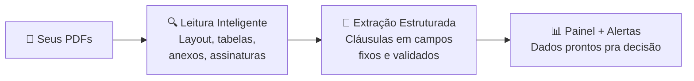

<CoverSlide
  eyebrow="Suporte Operacional: Fórum de Gestão Tecnológica"
  title="Do Dado à Decisão"
  subtitle="Soluções de IA Ajustadas ao <br>Negócio de Contratação"
  presenter="R. M. Ferrari"
  location="Vitória, ES"
  date="Junho de 2026"
/>

---

# Mudanças à vista

<div class="glass mt-8">
  Na era da IA Generativa, as LLMs estão remodelando como as decisões são tomadas nas organizações. Como estamos nos preparando?
      <div class="mt-6 flex gap-3">
      <span class="tag">LLMs</span>
      <span class="tag">IA Generativa</span>
      <span class="tag">Contratos</span>
      </div>
</div>

---

# Gestão de Contratos

- Documento → risco silencioso
- 80 páginas → ninguém lê tudo
- O problema já está lá. Esperando.

<Spacer :h="28"/>

<BeforeAfter language="pt">>
<template #before>

Você vai ao contrato quando o problema <HighLight  color="#EC635E"> já aconteceu</HighLight>.

</template>
<template #after>

Com IA: o contrato <HighLight color="#e2f81b"> te avisa antes</HighLight>.

</template>
</BeforeAfter>

::note::
Contratos: não são apenas documentos. São riscos silenciosos espalhados em 80 páginas que você não tem tempo de ler.

Gestão contratual tradicional considera cada contrato um documento, e até um potencial fator de risco. A gente fala em "contrato" no corredor e as pessoas associam com problemas.

A IA transforma contratos em sinais operacionais, informações vivas capazes de te avisarem antes que o problema aconteça.

---

# O contrato como fonte de dados

<div class="mt-10">
<MetricCard
  value="PDF → Dados → Inteligência "
  label="Páginas de textos podem se transformar em conhecimento e acompanhamento."
/>
</div>


::note::
“ Durante o dia de hoje, vocês vão aprender técnicas e 
prompts para fazer as perguntas corretas.
Hoje eu vim mostrar que além de responder perguntas sob demanda,
IA habilita analytics. Vigilância. Antecipação”

---

# Caso 01
## Grupos e Anomalias

<div class="grid gap-12 mt-5"
style="grid-template-columns: 4fr 6fr;"
>

<div>

<div style="font-size: 0.9rem">
<PromptCard title="Extração Dados">
Você é um assessor jurídico especista em digitalização de informações do contrato recebido Extraia:

  - Categoria, entre: engenharia, jurídico, saúde ou secretaria.
  - Número de posições
  - Valor mensal
  - Fornecedor
</PromptCard>
</div>
</div>

<v-click>

<div style="font-size: 0.9rem">
<div>
  <table class="rf-table">
    <thead>
      <tr>
        <th>Categoria</th>
        <th>Posições</th>
        <th>Valor mensal</th>
        <th>Fornecedor</th>
      </tr>
    </thead>
    <tbody>
      <tr>
        <td>Engenharia</td>
        <td>82</td>
        <td>R$ 1.600.000</td>
        <td>BB Consulting</td>
      </tr>
      <tr>
        <td>Jurídico</td>
        <td>12</td>
        <td>R$ 480.000</td>
        <td>Lex Group</td>
      </tr>
      <tr>
        <td>Secretariado</td>
        <td>24</td>
        <td>R$ 210.000</td>
        <td>Prime Office</td>
      </tr>
      <tr>
        <td>Saúde</td>
        <td>18</td>
        <td>R$ 234.000</td>
        <td>MedCayre</td>
      </tr>
    </tbody>
  </table>
</div>
</div>
</v-click>


</div>

---

# Ciência de Dados → Ciência de Dados Contratuais

<div
  class="grid gap-0 mt-15 items-center"
  style="grid-template-columns: 1fr 1fr;"
>

<div>

<Venn
  top="Negócio"
  left="Estatística"
  right="Computação"
  center="Ciência de\nDados"
  size="430px"
  :transpLight="0.20"
  :transpDark="0.15"
/>

</div>

<div v-click>

<Venn
  top="Contratos"
  left="Análise e projeção \n de dados"
  right="Algoritmos e IA"
  center="\n🫵"
  centerSize="70"
  size="430px"
  :transpLight="0.20"
  :transpDark="0.15"
/>

</div>

</div>

---

# Limite 2: Alucinação

<div class="mt-10">

A IA tem pavor de dizer **"não sei"**.

Quando não encontra — **ela inventa**.

Com a mesma voz de quem encontrou.

</div>

::note::
O segundo limite se chama alucinação. É quando a IA não encontra a informação — mas em vez de dizer 'não sei', ela cria uma resposta que parece plausível. Testei isso: peguei um contrato que não tinha multa rescisória definida. Perguntei: 'qual é o valor da multa?' Ela respondeu: 8%. Com total confiança. De onde veio esse 8%? Ela também não sabe.

---

# O GPS no Lago

<ImagePanel
  src="https://via.placeholder.com/600x400?text=GPS+in+Lake"
  position="right"
  width="50%"
  fit="contain"
  caption="Confiante. Errado."
>

### IA sem validação

A IA não avisa quando erra. Em contratos, um número inventado numa cláusula pode custar muito caro.

</ImagePanel>

::note::
É como perguntar pro GPS uma rua que não existe. O sistema segue em frente com total confiança — mesmo direto pro lago. Sem admitir o erro.

---

# A IA Quer te Agradar

<div class="mt-10">

A IA foi **literalmente treinada pra te agradar**.

Aprende com feedback humano — quando a gente gosta da resposta, ela reforça aquilo.

O problema: **"te agradar" e "ser preciso"** são objetivos opostos.

</div>

::note::
Sabe por que a IA alucina com tanta frequência? Porque ela foi treinada pra te agradar. Quando você pergunta 'qual é a multa rescisória?' — a resposta que te agrada é um número. A resposta honesta, se o contrato não define, é: 'não existe.' Mas adivinhem qual ela prefere te dar.

---

# Limite 3: Variabilidade de Documentos

<div class="grid grid-cols-3 gap-4 mt-8" style="font-size: 0.85rem;">

<div class="glass p-4">

### Contrato A — 2015

```
Multa rescisória:
5% do valor total
```

✓ Simples. IA acha fácil.

</div>

<div class="glass p-4">

### Contrato B — 2019

```
Penalidade conforme
tabela do Anexo D
```

⚠️ Anexo D não está
no PDF.

</div>

<div class="glass p-4">

### Contrato C — 2023

```
Indenização pelos
custos operacionais
até a data...
```

✗ Quanto é isso?
Depende de variáveis
externas.

</div>

</div>

::note::
Terceiro limite — esse não é culpa da IA. É culpa dos próprios contratos. Três formas diferentes de dizer — ou não dizer — a mesma coisa. Multiplicado por 80 contratos, isso vira um problema operacional.

---

# O Chaveiro ✂️

<ImagePanel
  src="https://via.placeholder.com/600x400?text=Keyring"
  position="right"
  width="50%"
  fit="contain"
  caption="Uma chave por fechadura"
>

### Cada contrato é único

Usar o mesmo prompt pra contratos diferentes é como tentar abrir todas as fechaduras com a mesma chave.

A solução não é ter mais força — é ter a chave certa.

</ImagePanel>

---

# Então o Que Fazer?

<div class="text-center mt-16">

Voltamos pro **papel** e pro **advogado**?

</div>

<v-click>

<div class="text-center mt-8">

**Não.** Mas a IA crua também não é suficiente.

O que funciona é **colocar estrutura em volta da IA**.

</div>

</v-click>

::note::
O que você faz? Volta pro papel e pro advogado lendo contrato por contrato? Não. Mas a IA crua também não é suficiente — pelo menos não pra quem precisa de confiabilidade, rastreabilidade e escala.

---

# 🔦 FAROL DE CONTRATOS

<div class="glass mt-12">

**Inteligência aplicada à gestão de contratos.**

Você carrega seus PDFs — do jeito que estão — e o sistema lê, extrai as informações críticas, organiza num painel e avisa quando algo precisa de atenção.

Não substitui o advogado. Substitui o trabalho de ler 50 páginas pra descobrir uma data.

</div>

::note::
O Farol de Contratos é uma solução que resolve exatamente o que mostrei. Primeira aparição do nome e conceito.

---

# Como Funciona

<ArchitectureFlow>



</ArchitectureFlow>

::note::
Primeiro: o sistema lê o PDF de verdade. Segundo: extrai informações em campos fixos, não inventa. Terceiro: tudo aparece num painel com alertas e scores de risco.

---

# A Lista de Mercado

<ImagePanel
  src="https://via.placeholder.com/600x400?text=Shopping+List"
  position="right"
  width="50%"
  fit="contain"
  caption="Estrutura + Confiabilidade"
>

### Diferença entre IA crua e o Farol

Mandar alguém no mercado **sem lista** vs **com uma lista bem feita**.

Sem lista: volta com o que achou.

Com lista: você sabe exatamente o que pediu e o que faltou.

</ImagePanel>

---

# O Detetive

<ImagePanel
  src="https://via.placeholder.com/600x400?text=Sherlock+Holmes"
  position="right"
  width="50%"
  fit="contain"
  caption="Rastreabilidade completa"
>

### Você não precisa confiar — você pode verificar

Quando o Farol diz que a multa é 5%, ele te mostra onde está escrito.

**Fonte: Cláusula 8.2, página 12.**

</ImagePanel>

::note::
O que mais me incomoda na IA crua é que você não sabe de onde veio a resposta. O Farol funciona diferente: quando extrai, ele cita a fonte. Você pode abrir o PDF e conferir.

---

# DEMONSTRAÇÃO

<div class="text-center mt-20">

Carregando contratos reais...

</div>

::note::
Neste momento você compartilha a tela do sistema. 
- Passso 1: Carregamento de 5 contratos reais
- Passo 2: Processamento (30-60s) — o sistema está lendo layout, identificando cláusulas, estruturando em campos
- Passo 3: Painel aparece — cinco contratos, dois em Risco Alto, um em Crítico
- Passo 4: Clica no contrato crítico — renovação automática detectada, prazo 90 dias, data limite calculada
- Passo 5: Mostra a fonte — Cláusula 8.2, página 12, rastreável
- Passo 6: Campo com baixa confiança em amarelo — sistema marcou incerteza em vez de inventar

---

# O Que o Farol Extrai (Padrão)

<div class="mt-10">

<div class="glass p-6">

```
✓  Número do contrato
✓  Quem contrata / quem é contratado
✓  Valor total
✓  Data de assinatura
✓  Data de vencimento
✓  Score de risco (Baixo / Médio / Alto / Crítico)
✓  Tem renovação automática? (Sim / Não)
```

</div>

</div>

<div class="mt-6 text-sm opacity-75">

**Mas cada negócio tem o que importa pra ele.**

</div>

::note::
Esses são os campos que o Farol extrai por padrão. É um bom começo pra qualquer empresa. Mas é só o começo.

---

# O Cardápio

<ImagePanel
  src="https://via.placeholder.com/600x400?text=Restaurant+Menu"
  position="right"
  width="50%"
  fit="contain"
  caption="Personalização ilimitada"
>

### Você escolhe o que importa

Logística? SLA de entrega.

Setor público? Número de licitação e dotação orçamentária.

Serviços recorrentes? Cláusula de exclusividade.

**Qualquer campo que faz sentido — o Farol extrai.**

</ImagePanel>

---

# O Que Está Faltando?

<div class="glass mt-16 text-center p-12">

### O que vocês sentiriam falta no dia a dia?

**Olhando pra lista de campos padrão — qual informação vocês queria ter tido?**

</div>

::note::
Esse é o slide mais importante da segunda metade. Deixa alguém responder. Anota o que as pessoas falam — vai virar argumento personalizado na conversa depois.

---

# O Que o Farol NÃO Faz

<div class="grid grid-cols-2 gap-8 mt-10">

<div class="glass p-6">

### O Farol FAZ

✓ Extrai dados estruturados  
✓ Identifica padrões  
✓ Alerta sobre anomalias  
✓ Escala para centenas  
✓ Rastreia a fonte  
✓ Marca incertezas  

</div>

<div class="glass p-6">

### O Farol NÃO FAZ

✗ Julga se o contrato é bom ou ruim  
✗ Interpreta lei  
✗ Resolve anexos faltantes  
✗ Substitui advogado em casos complexos  

</div>

</div>

::note::
A divisão de trabalho é clara: Farol faz o trabalho sujo de leitura. Você e seu time fazem o trabalho que exige julgamento.

---

# Moral

<div class="glass mt-16 p-10 text-center">

### Informação escondida num PDF não serve pra ninguém.

**O Farol ilumina o que está lá —**

**pra você decidir com dados, não com sorte.**

</div>

---

# Perguntas?

<div class="text-center mt-20">

🔦 **FAROL DE CONTRATOS**

ramon.ferrari@gmail.com

</div>

---

<div class="rf-center h-full px-20">

  <div class="rf-eyebrow rf-reveal">
    TRANSFORMAÇÃO DIGITAL
  </div>

  <h1 class="rf-hero rf-reveal-2">
    IA PARA
    <br />
    DECISÕES
    <br />
    OPERACIONAIS
  </h1>

</div>

---

<HeroSlide
  eyebrow="TRANSFORMAÇÃO DIGITAL"
  title="IA PARA DECISÕES OPERACIONAIS"
/>

---

<div class="absolute inset-0" style="background: #131414; background-image: radial-gradient(circle at 100% 0%, #0c63556e 0%, transparent 40%), radial-gradient(circle at 0% 100%, #0c63556e 0%, transparent 35%);"></div>

<div class="relative z-10 text-center h-full flex flex-col justify-center" style="padding: 4rem 2rem;">

<div style="font-size: 4.5rem; margin-bottom: 2rem;">🔍</div>
<h2 style="font-size: 2.2rem; font-weight: 900; margin: 0 0 3rem 0; color: white;">FAROL DE CONTRATOS</h2>
<p style="font-size: 0.95rem; color: #cbd5e1;">ES/ENGP - CSDA</p>

</div>

---

# A IA não tem memória. Tem mesa de trabalho.

<Contextdesk />

---

# Tanto faz o modelo? Atenção aos flash X pro

<ModelComparison />

---


# Somos todos cientistas

<DataVSContract />

---

# Luz sobre riscos silenciosos

<AISpotlight />

---


