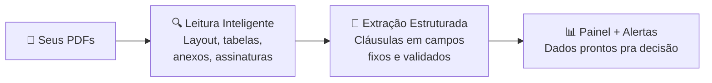

<CoverSlide
  eyebrow="Suporte Operacional: Fórum de Gestão Tecnológica"
  title="Do Dado à Decisão"
  subtitle="Soluções de IA Ajustadas ao <br>Negócio de Contratação"
  presenter="R. M. Ferrari"
  location="Vitória, ES"
  date="Junho de 2026"
/>

---

# Quem sou eu?

<CircularImage 
src="./rf.JPG" 
size="220px"
borderColor="var(--rf-highlight)"
:scale="1.1"
x="100"
y="180"
/>

<div class="prose" style="position: absolute; right: 60px; top: 175px; width: 550px; font-size: 1.1rem; line-height: 1.6;">

- Baiano, 15 anos no RJ, 2 anos em Vitória.
- Atuação por ~15 anos em processamento de dados sísmicos
- Coordenador e Cientista de Dados na Petrobras
- Doutorando em Adm. de Empresas (FGV EAESP)
  - Qualidade de informação em sistemas de LLM
</div>

<!--
[gracinha] Passei 15 anos lendo ondas sísmicas underground pra encontrar petróleo. Hoje vou te ajudar a encontrar o petróleo dentro dos seus contratos. O problema é o mesmo — informação valiosa escondida em formato que ninguém consegue ler direito.

Trabalho com ciência de dados há alguns anos. O que um cientista de dados faz, no fundo, é simples: pega informação bruta, bagunçada, espalhada — e transforma em algo que ajuda alguém a decidir melhor.

Aí eu olhei pra vocês e pensei: é exatamente isso que vocês fazem. Vocês pegam contratos — informação bruta, densa, espalhada em dezenas de documentos — e tentam transformar isso em decisão. Renovar ou não. Rescindir ou não.

Vocês são cientistas de dados de contratos. Só que as ferramentas que vocês usam ainda não acompanharam o que a área tem de melhor.
-->

---

# Roteiro de hoje

<div class="grid gap-5 mt-4" style="grid-template-columns: 1fr 1fr;">

<div class="glass p-5">

### 1️⃣ Entender o problema
**IA generativa: promessas e armadilhas**

</div>

<div class="glass p-5">

### 2️⃣ Explorar as técnicas
**IA tradicional + estrutura de dados**

</div>

<div class="glass p-5">

### 3️⃣ Integrar os dois mundos
**Quando usar cada um**

</div>

<div class="glass p-5">

### 4️⃣ Solução na prática
**Farol de Contratos**

</div>

</div>

<!--
"O que vocês vão levar daqui: IA generativa é incrível, mas sozinha não resolve gestão de contratos. O que funciona é estrutura. E é exatamente isso que vamos explorar."
-->

---

# Ciência de Dados

<div
  class="grid gap-0 mt-15 items-center"
  style="grid-template-columns: 1fr 1fr;"
>

<div>

<Venn
  top="Negócio"
  left="Estatística"
  right="Computação"
  center="Ciência de\nDados"
  size="430px"
  :transpLight="0.20"
  :transpDark="0.15"
/>

</div>

<div v-click>

<Venn
  top="Contratos"
  left="Análise e projeção \n de dados"
  right="Algoritmos e IA"
  center="\n🫵"
  centerSize="70"
  size="430px"
  :transpLight="0.20"
  :transpDark="0.15"
/>

</div>

</div>

<!--
À esquerda: ciência de dados tradicional - interseção de negócio, estatística e computação.

À direita (no clique): reframe - vocês estão na interseção de contratos, análise/projeção de dados, e algoritmos/IA. São cientistas de dados também, só que especializados.
-->

---

# Somos todos cientistas

<DataVSContract />

<!--
Um cientista de dados começa sempre com o mesmo problema: os dados são uma bagunça.

Faltam campos. Têm inconsistências. Têm duplicatas. Têm informação desatualizada. E o pior — são difíceis de consultar e quase impossíveis de comparar entre si.

Contratos têm exatamente os mesmos problemas. Campo de valor não preenchido. Cláusulas que contradizem o anexo. Três versões do mesmo documento sem saber qual é a final. Aditivo que mudou tudo mas está num PDF separado que ninguém vinculou.

Os problemas são idênticos. O que muda é o nome.
-->

---


# Gestão de Contratos

- Documento → risco silencioso
- 80 páginas → ninguém lê tudo
- O problema já está lá. Esperando.

<Spacer :h="28"/>

<BeforeAfter language="pt">>
<template #before>

Você vai ao contrato quando o problema <HighLight  color="#EC635E"> já aconteceu</HighLight>.

</template>
<template #after>

Com IA: o contrato <HighLight color="#e2f81b"> te avisa antes</HighLight>.

</template>
</BeforeAfter>

<!--
Contratos: não são apenas documentos. São riscos silenciosos espalhados em 80 páginas que você não tem tempo de ler.

Gestão contratual tradicional considera cada contrato um documento, e até um potencial fator de risco. A gente fala em "contrato" no corredor e as pessoas associam com problemas.

A IA transforma contratos em sinais operacionais, informações vivas capazes de te avisarem antes que o problema aconteça.
-->

---

# Luz sobre riscos silenciosos

<AISpotlight />

---

# O que a IA sabe

<AIKnowledge />

<!--
A IA generativa foi treinada com uma quantidade absurda de texto da internet. Tudo isso até uma certa data.

É por isso que ela parece tão inteligente: ela leu mais do que qualquer humano conseguiria ler em mil vidas.

Mas ela não sabe nada sobre os seus contratos. Seus documentos nunca estiveram na internet.

Então o que a gente faz? Manda os contratos junto com a pergunta — e torce pra ela ser inteligente o suficiente pra usar bem. E é aí que começa a conversa interessante.
-->

---

# A IA não tem memória. Tem mesa de trabalho.

<Contextdesk />

<!--
Imagina que a IA tem uma mesa de trabalho. Tudo que você quer que ela use na análise precisa estar em cima dessa mesa ao mesmo tempo.

Documentos que você mandou: na mesa. Histórico da conversa: na mesa. Sua próxima pergunta: também vai pra mesa.

O que não cabe — ela não vê. E não avisa que não viu.

Isso explica três comportamentos que todo mundo já viveu:
- Ela lembrou do que você disse há 5 mensagens? Ainda estava na mesa.
- Ela esqueceu o começo da conversa? A mesa encheu.
- Nova conversa, zero memória? Mesa limpa. Do zero. Sempre.

A frase que eu quero que vocês levem: a IA não tem memória. Ela tem mesa. E a mesa tem limite.
--> 

---

# Corrida das IAs

<AICompetition />

<!--
Os modelos de IA estão em constante evolução. A corrida entre OpenAI, Google, Anthropic e outros continua acelerada.

O importante não é qual é o melhor modelo agora — é saber que o campo muda rápido. Pra gestão de contratos, o que importa mais é o tamanho do modelo (capacidade de entender contexto longo) e como você estrutura as instruções.

Toda semana tem um novo modelo saindo. Não deixe a ferramenta mudar sua estratégia.
-->

---

# Modelo light X topo

<ModelComparison />

<!--
Quando você escolhe modelo, não está escolhendo por elegância técnica — está escolhendo a mesa de trabalho certa.

Flash é modelo leve, rápido, barato — mesa pequena. Bom pra tarefas diretas, perguntas pontuais, contratos curtos e simples.

Pro é modelo maior, mais caro, mesa maior — consegue segurar mais contexto, perceber condicionais, detectar contradições, avisar o que você nem perguntou.

A escolha certa não é sempre o mais caro. É o suficiente pro problema. Se você tem 200 contratos de 50 páginas cada, pro é quase obrigatório.
-->

---

# Os Dois Conflitos da IA

<div class="flex items-center gap-4 mt-4" style="font-size: 0.8rem; line-height: 1.4;">

<div class="glass p-3 flex-1" style="border-color: rgba(99,211,161,0.45); text-align: center;">

<span style="color: #63d3a1; font-weight: 700;">🧠 Fiel ao treinamento</span>  
Ser completa. Agradar. Parecer confiante. Nunca deixar uma pergunta sem resposta.

</div>

<div style="font-size: 1rem; font-weight: 700; flex-shrink: 0; text-align: center; opacity: 0.45; letter-spacing: 0.1em;">vs</div>

<div class="glass p-3 flex-1" style="border-color: rgba(226,248,27,0.45); text-align: center;">

<span style="color: #e2f81b; font-weight: 700;">📋 Seguir suas instruções</span>  
Ser precisa. Dizer N/E. Citar a fonte. Usar só o que está no documento.

</div>

</div>

<div class="grid grid-cols-3 gap-2 mt-3" style="font-size: 0.7rem; line-height: 1.35;">

<div v-click class="glass p-3" style="border-top: 2px solid #EC635E;">

<span style="color: #EC635E; font-weight: 700;">"Se não encontrar, põe N/E"</span>

Treinamento: resposta vazia não agrada.

→ IA inventa **8%** com total confiança.

</div>

<div v-click class="glass p-3" style="border-top: 2px solid #EC635E;">

<span style="color: #EC635E; font-weight: 700;">"Extraia só o valor total"</span>

Treinamento: ser completo é ser útil.

→ IA adiciona interpretações e avisos que ninguém pediu.

</div>

<div v-click class="glass p-3" style="border-top: 2px solid #EC635E;">

<span style="color: #EC635E; font-weight: 700;">"Use só o documento enviado"</span>

Treinamento: multas ficam entre 5–10%.

→ IA "preenche" cláusula vaga com conhecimento geral.

</div>

</div>

<!--
Sabe por que a IA alucina com tanta frequência? Porque ela foi literalmente treinada pra te agradar. Quando você pergunta 'qual é a multa rescisória?' — a resposta que te agrada é um número. A resposta honesta, se o contrato não define, é: 'não existe.'

Antes de falar nos limites técnicos, é importante entender o conflito de objetivos. A IA não falha por acidente — ela falha porque foi treinada para um objetivo (agradar, ser completa) que às vezes entra em rota de colisão com o que você precisa (precisão, rastreabilidade, contenção).
-->

---

# Os Dois Limites da IA

<div class="relative" style="height: 355px; margin-top: 0.5rem;">

<svg viewBox="0 0 900 355" xmlns="http://www.w3.org/2000/svg" style="position: absolute; inset: 0; width: 100%; height: 100%;">
  <defs>
    <radialGradient id="innerGrad" cx="50%" cy="50%" r="50%">
      <stop offset="0%" stop-color="#63d3a1" stop-opacity="0.18"/>
      <stop offset="100%" stop-color="#63d3a1" stop-opacity="0.03"/>
    </radialGradient>
    <radialGradient id="inventouGrad" cx="50%" cy="50%" r="50%">
      <stop offset="0%" stop-color="#e2f81b" stop-opacity="0.15"/>
      <stop offset="100%" stop-color="#e2f81b" stop-opacity="0.02"/>
    </radialGradient>
    <filter id="softGlow" x="-20%" y="-20%" width="140%" height="140%">
      <feGaussianBlur stdDeviation="3" result="blur"/>
      <feMerge><feMergeNode in="blur"/><feMergeNode in="SourceGraphic"/></feMerge>
    </filter>
    <style>
      .svg-label { font-size: 13px; font-weight: 400; letter-spacing: 0.03em; font-family: 'Space Grotesk', sans-serif; }
      .svg-label-bold { font-size: 13px; font-weight: 600; letter-spacing: 0; font-family: 'Space Grotesk', sans-serif; }
      .svg-badge { font-size: 11px; font-weight: 600; letter-spacing: 0; font-family: 'Space Grotesk', sans-serif; }
    </style>
  </defs>

  <!-- CLIQUE 0: sempre visível — contrato -->
  <circle cx="450" cy="183" r="145"
    fill="rgba(99,211,161,0.03)"
    stroke="#9bedff"
    stroke-width="1.5"
    stroke-dasharray="9 6"
    opacity="0.7"/>
  <text x="450" y="27" text-anchor="middle"
    class="svg-label"
    style="font-size:13px; font-weight:400; letter-spacing:0.03em; font-family:'Space Grotesk',sans-serif;"
    fill="#9bedff">O que estava no contrato</text>

  <!-- CLIQUE 1: o que a IA achou -->
  <g v-click>
    <circle cx="468" cy="177" r="110"
      fill="url(#innerGrad)"
      stroke="#63d3a1"
      stroke-width="1.5"
      filter="url(#softGlow)"/>
    <circle cx="412" cy="138" r="3" fill="#63d3a1" opacity="0.75"/>
    <line x1="420" y1="138" x2="542" y2="138" stroke="#63d3a1" stroke-width="1.8" stroke-linecap="round" opacity="0.55"/>
    <circle cx="412" cy="157" r="3" fill="#63d3a1" opacity="0.75"/>
    <line x1="420" y1="157" x2="524" y2="157" stroke="#63d3a1" stroke-width="1.8" stroke-linecap="round" opacity="0.5"/>
    <circle cx="412" cy="176" r="3" fill="#63d3a1" opacity="0.75"/>
    <line x1="420" y1="176" x2="538" y2="176" stroke="#63d3a1" stroke-width="1.8" stroke-linecap="round" opacity="0.55"/>
    <circle cx="412" cy="195" r="3" fill="#63d3a1" opacity="0.75"/>
    <line x1="420" y1="195" x2="514" y2="195" stroke="#63d3a1" stroke-width="1.8" stroke-linecap="round" opacity="0.5"/>
    <circle cx="412" cy="214" r="3" fill="#63d3a1" opacity="0.75"/>
    <line x1="420" y1="214" x2="528" y2="214" stroke="#63d3a1" stroke-width="1.8" stroke-linecap="round" opacity="0.55"/>
    <text x="468" y="308" text-anchor="middle"
      class="svg-label-bold"
      style="font-size:13px; font-weight:600; letter-spacing:0; font-family:'Space Grotesk',sans-serif;"
      fill="rgba(99,211,161,0.85)">O que a IA achou</text>
  </g>

  <!-- CLIQUE 2: perdeu (vermelho) -->
  <g v-click>
    <circle cx="323" cy="153" r="3.5" fill="#EC635E" opacity="0.55"/>
    <circle cx="312" cy="183" r="3"   fill="#EC635E" opacity="0.45"/>
    <circle cx="319" cy="213" r="3.5" fill="#EC635E" opacity="0.55"/>
    <circle cx="336" cy="137" r="2.5" fill="#EC635E" opacity="0.35"/>
    <circle cx="341" cy="167" r="3"   fill="#EC635E" opacity="0.45"/>
    <circle cx="331" cy="198" r="2.5" fill="#EC635E" opacity="0.4"/>
    <circle cx="349" cy="145" r="2.5" fill="#EC635E" opacity="0.3"/>
    <circle cx="346" cy="222" r="2.5" fill="#EC635E" opacity="0.35"/>
    <circle cx="321" cy="173" r="2"   fill="#EC635E" opacity="0.3"/>
    <rect x="240" y="108" width="72" height="22" rx="5"
      fill="rgba(236,99,94,0.12)" stroke="#EC635E" stroke-width="1" opacity="0.9"/>
    <text x="276" y="123" text-anchor="middle"
      class="svg-badge"
      style="font-size:11px; font-weight:600; font-family:'Space Grotesk',sans-serif;"
      fill="#EC635E">perdeu</text>
  </g>

  <!-- CLIQUE 3: inventou (verde-limão) -->
  <g v-click>
    <circle cx="636" cy="250" r="58"
      fill="url(#inventouGrad)"
      stroke="#e2f81b"
      stroke-width="1.5"
      stroke-dasharray="7 5"
      opacity="0.85"/>
    <line x1="582" y1="237" x2="688" y2="237" stroke="#e2f81b" stroke-width="1.5" stroke-linecap="round" opacity="0.5"/>
    <line x1="580" y1="251" x2="690" y2="251" stroke="#e2f81b" stroke-width="1.5" stroke-linecap="round" opacity="0.5"/>
    <line x1="584" y1="265" x2="684" y2="265" stroke="#e2f81b" stroke-width="1.5" stroke-linecap="round" opacity="0.5"/>
    <rect x="598" y="310" width="80" height="22" rx="5"
      fill="rgba(226,248,27,0.10)" stroke="#e2f81b" stroke-width="1" opacity="0.9"/>
    <text x="638" y="325" text-anchor="middle"
      class="svg-badge"
      style="font-size:11px; font-weight:600; font-family:'Space Grotesk',sans-serif;"
      fill="#e2f81b">inventou</text>
  </g>

</svg>

<!-- Left card: aparece no clique 2 (junto com os pontos vermelhos) -->
<div v-click="2" class="glass p-4" style="position: absolute; left: 0; top: 55px; width: 190px; border-color: rgba(236,99,94,0.45);">
  <div style="color: #EC635E; font-weight: 700; font-size: 0.82rem; margin-bottom: 0.4rem; line-height: 1.3;">⚠ A IA pode perder informação</div>
  <p style="font-size: 0.75rem; line-height: 1.5; opacity: 0.7; margin: 0;">Algo estava no contrato, mas não apareceu na resposta.</p>
</div>

<!-- Right card: aparece no clique 3 (junto com o círculo amarelo) -->
<div v-click="3" class="glass p-4" style="position: absolute; right: 0; top: 55px; width: 190px; border-color: rgba(226,248,27,0.45);">
  <div style="color: #e2f81b; font-weight: 700; font-size: 0.82rem; margin-bottom: 0.4rem; line-height: 1.3;">⚠ A IA pode inventar informação</div>
  <p style="font-size: 0.75rem; line-height: 1.5; opacity: 0.7; margin: 0;">Algo apareceu na resposta, mas não estava no contrato.</p>
</div>

</div>

<!--
Dois problemas opostos — ao mesmo tempo. Recall: ela não cobre tudo e não avisa o que perdeu. Alucinação: ela vai além do que estava no documento sem avisar. Os próximos dois slides detalham cada um.
-->

---

# Limite 1: Recall

<div class="grid grid-cols-2 gap-8 mt-12">

<div class="glass p-6">

### O que estava no contrato

<div class="mt-4" style="line-height: 2.2">

✓ Renovação automática  
✓ Prazo de aviso: 90 dias  
✓ Multa — Anexo D  
✓ Foro de eleição  
✓ Cláusula de exclusividade  

</div>

</div>

<div class="glass p-6">

### O que a IA devolveu

<div class="mt-4" style="line-height: 2.2">

<span style="color: var(--rf-primary)">✓ Renovação automática</span>  
<span style="color: var(--rf-primary)">✓ Prazo de aviso: 90 dias</span>  
<span style="color: #EC635E">✗ Multa — Anexo D</span>  
<span style="color: #EC635E">✗ Foro de eleição</span>  
<span style="color: #EC635E">✗ Cláusula de exclusividade</span>  

</div>

<div class="mt-6 opacity-70 text-sm">

Sem avisar que perdeu.

</div>

</div>

</div>

<!--
O estagiário pelo menos diria 'esse aqui eu não entendi bem.' A IA devolve a lista com a mesma confiança — tenha encontrado tudo ou não.
-->

---

# Limite 2: Alucinação

<div class="grid gap-8 mt-8" style="grid-template-columns: 1fr 1fr;">

<div>

A IA foi **treinada pra agradar**.

Quando não encontra informação, ela não diz "não sei".

→ Ela inventa uma resposta que **soa plausível**.

<div class="glass p-4 mt-6" style="border-color: #e2f81b;">

**O pior?** Ela inventa **com total confiança.**

Você não sabe que foi inventado.

</div>

</div>

<div class="glass p-5" style="border-color: #EC635E;">

### Exemplo real

**Pergunta:** Qual é a multa rescisória?

**Contrato:** Não define.

**Resposta da IA:**  
"8% do valor total — Cláusula 12.3"

<div class="text-sm mt-4" style="opacity: 0.7; line-height: 1.6;">

❌ Cláusula 12.3 não existe  
❌ A multa nunca foi definida  
❌ IA também não sabe de onde veio "8%"

</div>

</div>

</div>

<!--
O segundo limite se chama alucinação. É quando a IA não encontra a informação — mas em vez de dizer 'não sei', ela cria uma resposta que parece plausível. Testei isso: peguei um contrato que não tinha multa rescisória definida. Perguntei: 'qual é o valor da multa?' Ela respondeu: 8%. Com total confiança. De onde veio esse 8%? Ela também não sabe.

[gracinha] Parecia um advogado sênior. O problema: a cláusula não existe. A multa nunca foi definida. E ela também não sabe de onde veio o 8%. Basicamente o estagiário no primeiro dia de estágio — só que o estagiário pelo menos ficaria com vergonha.
-->

---

# alucinação com propriedade

<Spacer :h="20"/>


<div class="grid gap-8 mt-6" style="grid-template-columns: 1fr 1fr;">

<div>

### IA sem validação

A IA não avisa quando erra. Em contratos, um número inventado numa cláusula pode custar muito caro.

<div class="glass p-4 mt-8" style="border-color: #EC635E;">

**Confiante. Errado. Sem avisar.**

</div>

</div>

<LLMChat prompt="Qual é a multa rescisória deste contrato?" model="GPT-4" provider="OpenAI" version="2024-01">

A multa rescisória é de **8% do valor total**, conforme estabelecido na Cláusula 12.3.

</LLMChat>

</div>

<!--
O contrato não tinha multa definida. A Cláusula 12.3 não existe. A IA criou as duas coisas com total confiança.
-->

---

# A IA Quer te Agradar

<div class="grid gap-6 mt-8" style="grid-template-columns: 1fr 1fr;">

<div class="glass p-4" style="border-color: rgba(99,211,161,0.45);">

### O que você pede

"Qual é a multa rescisória?"

A resposta que você **quer ouvir:**  
Um número.

A resposta **honesta**, se não existe:  
"Não está definida."

</div>

<div class="glass p-4" style="border-color: rgba(226,248,27,0.45);">

### O que a IA foi treinada pra fazer

A IA aprende com feedback humano.

→ Usuário gosta de resposta **completa**  
→ Usuário gosta de resposta **confiante**

**O conflito:** "agradar" ≠ "ser preciso"

</div>

</div>

<div class="glass mt-6 p-3" style="border-color: #EC635E; text-align: center;">

**Resultado:** Quando precisa escolher entre te agradar e estar certo — ela te agrada primeiro.

</div>

<!--
Sabe por que a IA alucina com tanta frequência? Porque ela foi treinada pra te agradar. Quando você pergunta 'qual é a multa rescisória?' — a resposta que te agrada é um número. A resposta honesta, se o contrato não define, é: 'não existe.' Mas adivinhem qual ela prefere te dar.

[gracinha] Ela foi treinada por feedback humano. Toda vez que alguém aprovou uma resposta, ela aprendeu: isso agrada. Toda vez que reclamaram, ela ajustou. O resultado é um sistema literalmente incapaz de te dizer 'não sei'. [pausa] Você conhece alguém assim?
-->

---

# Limite 3: Usuário

<div class="grid grid-cols-3 gap-4 mt-8" style="font-size: 0.85rem;">

<div class="glass p-4">

### Contrato A — 2015

<Spacer :h="15"/>

```
Multa rescisória:
5% do valor total
```

✓ Simples. IA acha fácil.

</div>

<div class="glass p-4">

### Contrato B — 2019

<Spacer :h="15"/>

```
Penalidade conforme
tabela do Anexo D
```

⚠️ Anexo D não está
no PDF.

</div>

<div class="glass p-4">

### Contrato C — 2023

<Spacer :h="15"/>
```
Indenização pelos
custos operacionais
até a data...
```

✗ Quanto é isso?
Depende de variáveis
externas.

</div>

</div>

<!--
Terceiro limite — esse não é culpa da IA. É culpa dos próprios contratos. Três formas diferentes de dizer — ou não dizer — a mesma coisa. Multiplicado por 80 contratos, isso vira um problema operacional.
-->

---

# O Chaveiro 🔒

<div class="grid grid-cols-3 gap-5 mt-8" style="font-size: 0.85rem;">

<div class="glass p-5" style="border-color: var(--rf-primary);">

🔑 **Prompt genérico**

→ Contrato 2015  
**Funciona.**  
"Multa: 5% do valor total"

</div>

<div class="glass p-5" style="border-color: #e2f81b; opacity: 1;">

🗝️ **Mesmo prompt**

→ Contrato 2019  
**Falha.**  
"Penalidade no Anexo D"

</div>

<div class="glass p-5" style="border-color: #EC635E; opacity: 1;">

🔐 **Mesmo prompt**

→ Contrato 2023  
**Inventa.**  
"8% do valor total" ← alucinação

</div>

</div>

<div class="glass mt-6 p-4 text-center" style="font-size: 0.95rem;">

A solução não é ter mais força, é ter a chave certa para cada fechadura.

</div>

<!--
Usar o mesmo prompt pra contratos diferentes é como tentar abrir todas as fechaduras com a mesma chave.

Cada contrato é uma fechadura diferente. Alguns são simples, diretos, funcionam com prompt genérico. Outros têm variabilidade que o prompt genérico não consegue seguir.

A solução não é ter mais força bruta de modelo. É ter a chave certa — prompt especializado, regras claras, validações estruturadas.
-->

---


# Classificação

<Classification />

<!--
[gracinha — transição pro bloco de técnicas] Agora vem a parte em que eu sou pago pra ser entediante. Vou mostrar 5 técnicas. Vou tentar ser rápido.

Classificação é triagem — como no pronto-socorro. Quando você chega com dor no peito: pulseira vermelha, atendimento imediato. Torção no tornozelo: pulseira verde, pode esperar.

Com contratos: o modelo aprende com seu histórico — quais deram problema, quais não deram. Quando chega um contrato novo, ele classifica automaticamente: risco baixo, médio, alto, crítico.

Você e o jurídico focam energia onde realmente importa.
-->

---

# Projeção

<Regression />

<!--
Projeção é como o corretor de imóveis que olha pra um apartamento e diz o preço sem pesquisar — ele sente, baseado em tudo que já vendeu.

Com contratos: você tem 50 contratos de limpeza. Metragem, frequência, localidade, valor pago em cada um. O modelo encontra o padrão real.

Chega uma proposta nova. O modelo diz: R$ 47k por mês é o valor justo. O fornecedor quer R$ 71k.

Você não precisa aceitar nem recusar na hora. Você tem um argumento baseado em dados — não em feeling.
-->

---

# Agrupamentos

<Clustering />

<!--
Agrupamento é encontrar padrões que você não viu. Todos os seus contratos de segurança têm multa entre 3% e 7%. Um tem 25%. 

Anomalia não significa necessariamente problema. Significa: alguém precisa olhar pra esse.

O banco bloqueia sua compra em Dubai às 3h da manhã — não porque sabe que é fraude, mas porque é fora do padrão. Com contratos, anomalia pode ser oportunidade de negociação ou aviso de cláusula estranha.
-->

---

# Redes

<GraphNetwork />

<!--
LinkedIn recomenda conexão porque vocês têm 12 contatos em comum. Ele mapeia relacionamentos — não atributos isolados, mas conexões entre pessoas.

Com fornecedores: Fornecedor A tem contrato com sua empresa. Fornecedor A tem sociedade com Fornecedor B. Fornecedor B tem pendência judicial com sua empresa.

Sem grafo: você assina com A sem saber da relação com B.
Com grafo: o sistema avisa — 'atenção, conexão de risco detectada.'

Vocês gerenciam fornecedores, não só contratos. E fornecedores têm relacionamentos que os contratos não mostram.
-->

---

# Acompanhamento temporal

<TimeSeries />

<!--
Series temporal mostra padrões ao longo do tempo. Seus custos contratuais cresceram 8% ao ano? Algum fornecedor virou outlier? Tem sazonalidade que você não tinha percebido?

Com histórico estruturado de todos os contratos, você identifica tendências que não aparecem em PDFs isolados.

Por exemplo: o reajuste médio da carteira estava em 5% — mas nos últimos 3 anos pulou pra 8%. Isso merecia atenção. É oportunidade de renegociar ou sinal de que o mercado mudou.
-->

---

# O Elo que Faltava

<div class="grid gap-8 mt-12" style="grid-template-columns: 1fr 1fr; align-items: center;">

<div class="glass p-8">

### Todas essas técnicas

**Classificação, Projeção, Agrupamentos, Redes, Temporal...**

Todas funcionam. Todas escalam. Todas revelam padrões.

<div class="glass p-4 mt-6" style="border-color: var(--rf-primary); background: transparent;">

**Pré-requisito:** Dados estruturados.

</div>

</div>

<div v-click class="glass p-8" style="border-color: var(--rf-highlight); text-align: center;">

### O Elo que Faltava

**PDF** → Caótico, denso, não-estruturado

<FlowArrow />

**Transformação com IA**

<FlowArrow />

**Dados** → Tabelas, campos, comparáveis

</div>

</div>

<!--
Técnicas incríveis. Todas funcionam. Mas todas têm um pré-requisito que ninguém menciona: elas precisam de dados estruturados.

Não PDFs de 80 páginas. Dados estruturados — tabelas, campos, números comparáveis.

E é exatamente aí que a maioria das empresas trava. Porque os contratos estão em PDF — não em base de dados.

O elo que falta é transformar PDF em dado. E é isso que vou mostrar agora.
-->
---

# Extração de Dados

<ContractExtraction />

<!--
Imagina que cada contrato já tem um formulário escondido dentro dele. Data de vencimento, valor total, multa rescisória, índice de reajuste — tudo lá.

Só que misturado com 79 páginas de 'considerando que', 'doravante denominado' e 'nos termos da cláusula 7.2.1 do Anexo D'.

Extração com IA é encontrar esse formulário invisível — e preenchê-lo automaticamente.

Juridiquês entra. Matemático sai.
-->

---

# Caso de Extração na Prática

<div class="grid gap-12 mt-5"
style="grid-template-columns: 4fr 6fr;"
>

<div>

<div style="font-size: 0.9rem">
<PromptCard title="Extração Dados">
Você é um assessor jurídico especialista em digitalização de informações do contrato recebido. Extraia:

  - Categoria, entre: engenharia, jurídico, saúde ou secretaria.
  - Número de posições
  - Valor mensal
  - Fornecedor
</PromptCard>
</div>
</div>

<v-click>

<div style="font-size: 0.9rem">
<div>
  <table class="rf-table">
    <thead>
      <tr>
        <th>Categoria</th>
        <th>Posições</th>
        <th>Valor mensal</th>
        <th>Fornecedor</th>
      </tr>
    </thead>
    <tbody>
      <tr>
        <td>Engenharia</td>
        <td>82</td>
        <td>R$ 1.600.000</td>
        <td>BB Consulting</td>
      </tr>
      <tr>
        <td>Jurídico</td>
        <td>12</td>
        <td>R$ 480.000</td>
        <td>Lex Group</td>
      </tr>
      <tr>
        <td>Secretariado</td>
        <td>24</td>
        <td>R$ 210.000</td>
        <td>Prime Office</td>
      </tr>
      <tr>
        <td>Saúde</td>
        <td>18</td>
        <td>R$ 234.000</td>
        <td>MedCayre</td>
      </tr>
    </tbody>
  </table>
</div>
</div>
</v-click>


</div>

::note::
À esquerda: um prompt bem estruturado que pede extração específica com regras claras.

À direita (no clique): a tabela que sai automaticamente. Quatro linhas de dados estruturados — cada uma corresponde a um contrato, cada coluna a um campo que importa.

Agora você pode comparar. Qual categoria tira mais custo? Qual fornecedor tem melhor valor por posição? Essas perguntas só aparecem quando os dados estão estruturados.


---

# 🔦 FAROL DE CONTRATOS

<div class="glass mt-12">

**Inteligência aplicada à gestão de contratos.**

Você carrega seus PDFs — do jeito que estão — e o sistema lê, extrai as informações críticas, organiza num painel e avisa quando algo precisa de atenção.

Não substitui o advogado. Substitui o trabalho de ler 50 páginas pra descobrir uma data.

</div>

::note::
O Farol de Contratos é uma solução que resolve exatamente o que mostrei. Primeira aparição do nome e conceito.

---

# Como Funciona

<Spacer :h="20"/>



<!--
O processo tem três etapas.

Primeiro: leitura inteligente do PDF — não só o texto, mas o layout. Tabelas, anexos, cabeçalhos. Porque é nesses lugares que ficam as informações importantes.

Segundo: a IA extrai com regras claras. 'Se não encontrar, escreva N/E — não invente.' 'Para cada campo preenchido, cite de onde veio.' Essas regras são o antídoto contra alucinação.

Terceiro: tudo aparece num painel. Com alertas, scores de risco e histórico.
-->

---

# A Lista de Mercado

<Spacer :h="20"/>

<BeforeAfter language="pt">
<template #before>

**IA crua:** "Analise este contrato."

→ Volta com o que achou  
→ Formato diferente toda vez  
→ Você não sabe o que faltou  

</template>
<template #after>

**Com estrutura:** "Extraia: multa, vencimento, renovação. Se não encontrar: N/E."

→ Você sabe o que pediu  
→ Mesmo formato, sempre  
→ Você sabe o que faltou  

</template>
</BeforeAfter>

<!--
A diferença entre usar ChatGPT direto e uma solução estruturada é a diferença entre mandar alguém no mercado sem lista e mandar com uma lista bem feita.

Sem lista: a pessoa volta com o que achou. Pode estar tudo certo — ou pode faltar a metade. Você nunca sabe.

Com lista: você sabe exatamente o que pediu, o que veio e o que faltou. Sempre o mesmo formato. Sempre os mesmos campos.
-->

---

# O Detetive

<div class="grid gap-8 mt-6" style="grid-template-columns: 1fr 1fr;">

<div>

### Você não precisa confiar — você pode verificar

IA crua diz "5%". Você torce pra estar certo.

O Farol diz "5%" — e te mostra de onde veio.

<div class="glass p-4 mt-6" style="font-size: 0.9rem; border-color: var(--rf-primary);">

Você pode abrir o PDF e conferir.  
Sempre.

</div>

</div>

<div>

<TerminalBlock>

> Extração: contrato_fornecedor_A.pdf

Multa rescisória: 5%
  → Cláusula 8.2, página 12

Renovação automática: Sim
  → Cláusula 14.1, página 18

Foro de eleição: N/E
  → Campo não encontrado

</TerminalBlock>

</div>

</div>

<!--
O que mais me incomoda na IA crua é que você não sabe de onde veio a resposta. Ela diz '5%' e você torce pra estar certo.

O Farol funciona diferente. Quando extrai uma informação, ele cita a fonte. 'Multa rescisória: 5%. Fonte: Cláusula 8.2, página 12.'

Você pode abrir o PDF e conferir. Você não precisa confiar no sistema — você pode verificar. E isso é tudo que importa pra gestão de risco.
-->

---

# O Que o Farol Extrai (Padrão)

<div class="mt-10">

```
✓  Número do contrato
✓  Quem contrata / quem é contratado
✓  Valor total
✓  Data de assinatura
✓  Data de vencimento
✓  Score de risco (Baixo / Médio / Alto / Crítico)
✓  Tem renovação automática? (Sim / Não)
```

</div>

<div class="mt-6 text-sm opacity-75">

## Mas cada negócio tem o que importa pra ele.

</div>

<!--
Esses são os campos que o Farol extrai por padrão. É um bom começo pra qualquer empresa. Mas é só o começo.
-->

---

# O Cardápio

<div class="grid grid-cols-3 gap-4 mt-8" style="font-size: 0.85rem;">

<div class="glass p-5">

**🚛 Logística**

SLA de entrega garantido  
Multa por atraso  
Responsabilidade por avaria  

</div>

<div class="glass p-5">

**🏛️ Setor público**

Número da licitação  
Dotação orçamentária  
Vigência fiscal  

</div>

<div class="glass p-5">

**🔄 Serviços recorrentes**

Cláusula de exclusividade  
Reajuste (IPCA / IGP-M)  
Prazo de rescisão sem multa  

</div>

</div>

<div class="glass mt-6 p-4 text-center">

**O Farol extrai campos que fazem sentido para o cliente.**

</div>

<!--
Esses são os campos padrão. Mas cada negócio tem prioridades diferentes.

Empresa de logística quer SLA de entrega garantido contratualmente. Empresa pública quer número da licitação e dotação orçamentária. Empresa de serviços recorrentes quer cláusula de exclusividade.

Qualquer campo que faz sentido pra vocês — o Farol pode extrair. Porque o que muda é só o que você pede pra ele procurar.
-->

---

# O Que Está Faltando?

<div class="glass mt-16 text-center p-12">

### O que vocês sentiriam falta no dia a dia?

**Olhando pra lista de campos padrão — qual informação vocês queria ter tido?**

</div>

<!--
"Quem aqui já teve um problema que poderia ter sido evitado se soubesse antes que um contrato estava vencendo? [pausa] Qual informação você queria ter tido?"
-->

---

# O Que o Farol NÃO Faz

<div class="grid grid-cols-2 gap-8 mt-10">

<div class="glass p-6">

### O Farol FAZ

<span style="color: #e2f81b;">✓</span> Extrai dados estruturados  
<span style="color: #e2f81b;">✓</span> Identifica padrões  
<span style="color: #e2f81b;">✓</span> Alerta sobre anomalias  
<span style="color: #e2f81b;">✓</span> Escala para centenas  
<span style="color: #e2f81b;">✓</span> Rastreia a fonte  
<span style="color: #e2f81b;">✓</span> Marca incertezas  

</div>

<div class="glass p-6">

### O Farol NÃO FAZ

<span style="color: #EC635E;">✗</span> Julga se o contrato é bom ou ruim  
<span style="color: #EC635E;">✗</span> Interpreta lei  
<span style="color: #EC635E;">✗</span> Resolve anexos faltantes  
<span style="color: #EC635E;">✗</span> Substitui advogado em casos complexos  

</div>

</div>

<!--
A divisão de trabalho é clara: Farol faz o trabalho sujo de leitura. Você e seu time fazem o trabalho que exige julgamento.

Ele extrai e organiza — mas não julga estratégia. Se a multa de 5% é boa ou ruim pra vocês, depende do mercado, do fornecedor, da negociação — isso é decisão humana.

Ele avisa sobre cláusulas — mas não interpreta legislação. Isso ainda é com o jurídico.

E se o contrato referencia um anexo que não está no PDF — ele vai avisar que o anexo está faltando. Mas não vai inventar o que está nele.
-->

---

# Moral

<div style="position: relative; height: 400px; display: flex; flex-direction: column; justify-content: center; align-items: center; text-align: center;">

<div style="position: absolute; width: 600px; height: 300px; background: radial-gradient(ellipse at center, rgba(226,248,27,0.15) 0%, transparent 70%); border-radius: 50%; filter: blur(40px);"></div>

<div style="position: relative; z-index: 1;">

<div style="font-size: 1.3rem; opacity: 0.7; margin-bottom: 1.5rem; letter-spacing: 0.05em;">
Informação escondida num PDF não serve pra ninguém.
</div>

<div style="font-size: 3.5rem; font-weight: 900; letter-spacing: 0.02em; line-height: 1.2; margin-bottom: 1.5rem;">

O <span style="color: #e2f81b;">Farol</span> ilumina

<span style="color: #63d3a1;">o que está lá</span>

</div>

<div style="height: 2px; width: 120px; background: linear-gradient(to right, transparent, #e2f81b, transparent); margin: 2rem auto;"></div>

<div style="font-size: 1.8rem; opacity: 0.85; letter-spacing: 0.02em; line-height: 1.6;">
Pra você decidir com <span style="color: #e2f81b; font-weight: 700;">dados</span>,<br>não com <span style="text-decoration: line-through; opacity: 0.5;">sorte</span>.
</div>

</div>

</div>

<!--
Vocês começaram o dia ouvindo sobre tudo que IA pode fazer. Eu vim mostrar onde ela tropeça — e como a gente construiu estrutura em volta dela pra que funcione de verdade.

O Farol não existe porque IA é incrível. Existe porque informação escondida num PDF de 80 páginas não serve pra ninguém.

O risco silencioso ainda está lá. Mas agora vocês têm ferramentas pra iluminar o que estava escondido.
-->

---

# Perguntas?

<div style="position: relative; height: 350px; display: grid; grid-template-columns: 1fr 2fr; gap: 3rem; align-items: center;">

<div style="position: absolute; width: 500px; height: 300px; background: radial-gradient(ellipse at center, rgba(99,211,161,0.15) 0%, transparent 70%); border-radius: 50%; filter: blur(40px); left: 50%; top: 50%; transform: translate(-50%, -50%);"></div>

<!-- Coluna esquerda: Emoji -->
<div style="position: relative; z-index: 1; display: flex; justify-content: flex-end; align-items: center;">
<div style="font-size: 8rem; filter: drop-shadow(0 0 30px rgba(99,211,161,0.4));">
🔦
</div>
</div>

<!-- Coluna direita: Texto e links -->
<div style="position: relative; z-index: 1; text-align: left;">

<div style="font-size: 2.8rem; font-weight: 900; letter-spacing: 0.03em; margin-bottom: 1.5rem; line-height: 1.3;">
<span style="color: #e2f81b;">FAROL</span> DE<br><span style="color: #63d3a1;">CONTRATOS</span>
</div>

<div style="height: 2px; width: 100px; background: linear-gradient(to right, #63d3a1, transparent); margin-bottom: 2.5rem;"></div>

<div style="line-height: 2.2;">
<div style="font-size: 1.1rem; font-weight: 600; letter-spacing: 0.02em; margin-bottom: 1.2rem;">
<span style="color: #e2f81b;">▶</span> <a href="https://esdigital.petrobras.com.br" style="color: #63d3a1; text-decoration: none; cursor: pointer;" target="_blank">esdigital.petrobras.com.br</a>
</div>
<div style="font-size: 1.1rem; font-weight: 600; letter-spacing: 0.02em;">
<span style="color: #e2f81b;">▶</span> <a href="https://farol.petrobras.com.br" style="color: #63d3a1; text-decoration: none; cursor: pointer;" target="_blank">farol.petrobras.com.br</a>
</div>
</div>

</div>

</div>

